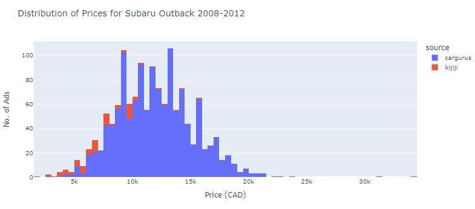

# Fortunato Wheels Engine

This is the data engine for the Fortunato Wheels project. It manages gathering, parsing and updating the data used to power the Fortunato wheels website.

## Getting Started

These instructions will get you a copy of the project up and running on your local machine for development and testing purposes. See deployment for notes on how to deploy the project on a live system.

### Setup

To get started first setup the environments:

Create environment with Conda from environment.yml file:
```
conda env create -f environment.yml
```
Or with pip requirements.txt:
```
pip install -r requirements.txt
```

### Downloading & Preprocessing Data

There are two primary data sources, one is the Fortunato Wheels database hosted in a 
MongoDB instance on Azure. The other is the open source dataset of carguru.com ads.

1. Fortunato Wheels Database
    1. Get the connection string from the project owner.
    2. Put the connection string into the .env file in the root of the project.
    3. To get all car ads from the database use:
        ```
        from src.data.upload_to_db import connect_to_db
        clinet, db, collection = connect_to_db()
        all_ads_raw = pd.DataFrame(collection.find())
        ```
2. Carguru.com Ads: 2 Options - Download Already Processed or Process From Scratch 
   1. To download an already processed version of the dataset download the parquet file from:  
    [Link to Processed Cargurus Data Download (~3GB)](https://drive.google.com/file/d/1rGJALL3xeGaakTp3BfH5Fd8uI3EP_4x8/view?usp=share_link)
    2. Move the downloaded file to saved to `data/processed/`

    - OR: Process the data from scratch  

   1. Download the Kaggle dataset from: https://www.kaggle.com/datasets/ananaymital/us-used-cars-dataset
   3. Place the extracted CSV named to `cargurus-vehicle-ads.csv` in the `data/raw` folder.
   4. To preprocess the data and export to parquet run:
        ```
        python src/data/preprocess_cargurus.py
        ```
        This will take ~45 minutes to run and get all the USD to CAD exchange rates for all ads.
   5. The processed results will be saved to `data/processed/cargurus-vehicle-ads.parquet`

### Start Working with the Data

To start working with the data, make a copy of the `notebooks/getting-started.ipynb` notebook and start working from there. It imports all the necessary libraries and sets up the data into a single dataframe in a `CarAds` object and shows how to get data loaded into a dataframe.

Here is what the sample data looks like for Subaru Outback from 2008-2012:



## Running the tests

Pytest is used to manage the tests. To run the tests in the `tests` folder use the following command:

```
pytest tests
```

## Deployment

TODO: Add additional notes about how to deploy this on a live system


## Contributing

Please read [CONTRIBUTING.md](https://github.com/tieandrews/fortunato-wheels-engine/blob/main/CONTRIBUTING.md) for details on our code of conduct, and the process for submitting pull requests to us.

## Versioning

We use [SemVer](http://semver.org/) for versioning. For the versions available, see the tags on this repository.

## Authors

* **Ty Andrews** - *Initial work* - [LinkedIn](https://www.linkedin.com/in/ty-andrews/)


## License

This project is licensed under the MIT License - see the [LICENSE.md]([LICENSE.md](https://github.com/tieandrews/fortunato-wheels-engine/blob/main/LICENSE.md)) file for details